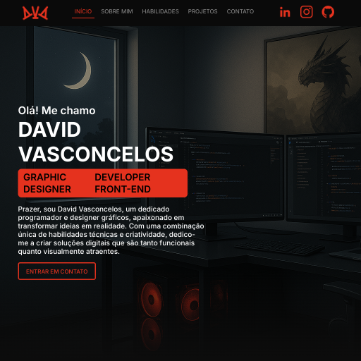

# Portfolio de Projetos

Bem-vindo ao repositório do meu portfólio pessoal! Este é um espaço onde apresento meus projetos, habilidades e a jornada que venho trilhando no mundo do desenvolvimento. O projeto foi construído com foco na simplicidade, com uma boa aparência e na facilidade de manutenção.

**Link do Site:** [https://dvdrIscado.github.io/Portfolio/](https://dvdrIscado.github.io/Portfolio/)



---

## ✨ Sobre o Projeto

Este portfólio foi desenvolvido para ser uma vitrine dinâmica e moderna dos meus trabalhos. A principal característica da sua arquitetura é a forma como os projetos são gerenciados: em vez de estarem fixos no código HTML, eles são carregados dinamicamente a partir de um arquivo JSON.

Essa abordagem, utilizando **JavaScript puro**, torna o processo de atualização extremamente eficiente. Para adicionar, remover ou editar um projeto, basta uma simples modificação no arquivo `projects.json`, e o JavaScript se encarrega de renderizar tudo na página.

---

## 🚀 Tecnologias Utilizadas

* **HTML5:** Para a estrutura semântica da página.
* **CSS3:** Para a estilização, design responsivo e animações.
* **JavaScript (Vanilla):** Para a manipulação do DOM, interatividade e carregamento dinâmico dos projetos a partir do arquivo JSON.
* **JSON:** Utilizado como um "banco de dados" leve para armazenar as informações de cada projeto.

---

## 🔧 Como Adicionar Novos Projetos

Visando a facilidade de atualização na aba de Projetos, foi desenvolvido um script de leitura do arquivo JSON que disponibiliza as informações dos projetos, tirando a necessidade de tocar nos arquivos HTML ou JavaScript para adicionar um novo trabalho ao portfólio. Siga os passos abaixo:

**1. Acesse o arquivo de dados:**

* Navegue até a pasta `js/` e abra o arquivo `projects.json`.

**2. Entenda a estrutura do JSON:**

* O arquivo contém uma lista (array) de objetos, onde cada objeto representa um projeto.
* A estrutura de cada objeto de projeto é a seguinte:

```json
{
  "id": 0,
  "nome": "Nome do Projeto",
  "topico": ["Site"],
  "descricao": "Uma breve descrição sobre o que o projeto faz, seus objetivos e os desafios enfrentados.",
  "link": [["link-para-o-site-do-projeto", "Texto do link"]],
  "ferramenta": ["HTML", "CSS", "JavaScript"],
  "instituicao": ["Instituição relacionada"],
  "media": [["link-para-a-imagem-do-projeto", "Texto da imagem"]],
  "background": "Código hexadecimal para a estilização do projeto."
}
```
---

## 📬 Contato

**David Vasconcelos Torquato**

* **LinkedIn:** [https://www.linkedin.com/in/dvdriscado/](https://www.linkedin.com/in/dvdriscado/)
* **GitHub:** [https://github.com/dvdRiscado](https://github.com/dvdRiscado)
* **Email:** `david.torquato@outlook.com`
